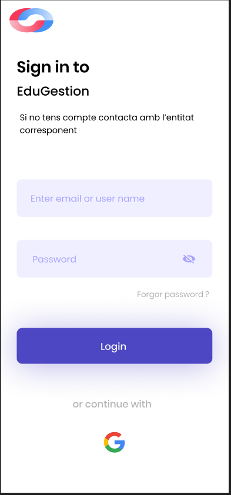
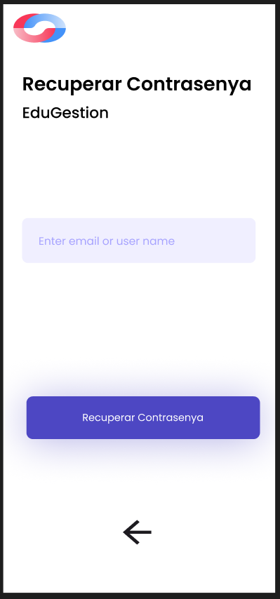
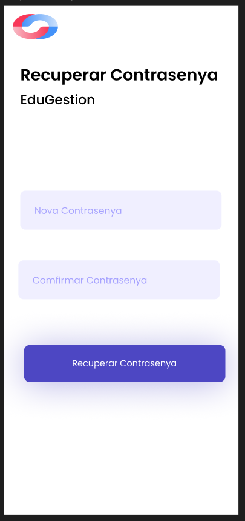
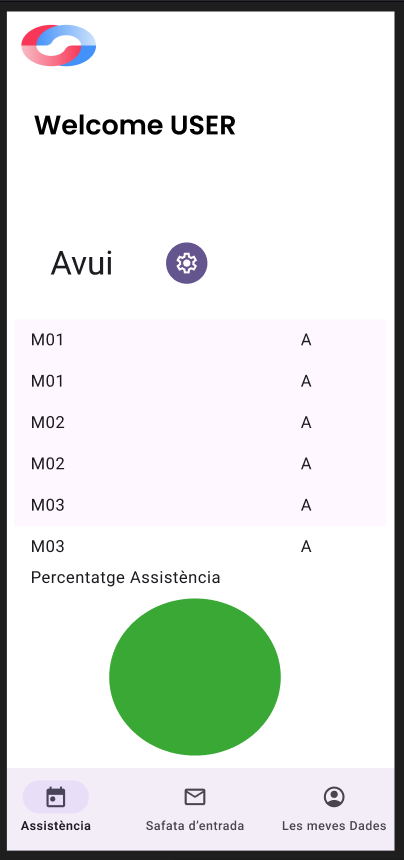
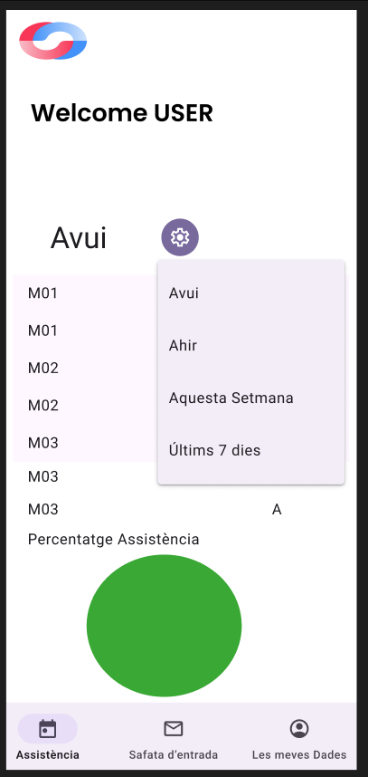

# WireframeProjecte

# DAM

## Login
El login té un camp per posar el mail, i un per a la contrasenya. També es podria fer el login amb el correu corporatiu. També hi ha l'opció de recuperar la contrasenya.    

## Recuperar Contrasenya
Recuperar contrasenya té 2 pantalles, una on es posa el mail per enviar el correu per poder accedir a la segona pantalla que és la de confirmar la contrasenya.  

## Assitencia
L'assitencia es la pagina principal, et mostra l'assistencia d'avui i una grafica del percentatge assistencia, tambe te un filtre per filtrar entre avui, ahir, l'ultims 7 dies i aquesta setmana.

# Wireframes Desktop
# DAW

Es una aplicación que permite la gestión y visualización de los datos del alumnado.

## Páginas en Común

### Página de Inicio
La página principal contiene un **header** donde se encuentra el logo, el nombre de la empresa, y las secciones de Productos, Ayuda, Contacto e inicio de sesión. En el centro, hay un eslogan y un breve texto acompañado de una imagen. Finalmente, tiene un **footer** con enlaces a las políticas de privacidad y redes sociales.

### Inicio de Sesión
Para obtener una cuenta, es necesario contactar con la empresa, indicando el tipo de entidad y rol dentro de la misma para recibir el acceso adecuado. Esta página permite iniciar sesión con el correo proporcionado por EduGestion.

### Recuperación de Contraseña
En caso de olvidar la contraseña, puedes recuperarla ingresando tu correo electrónico. Recibirás un enlace para restablecerla y, al completar el proceso, podrás iniciar sesión nuevamente.

---

## Administrador

### Añadir y Modificar Profesores
Esta sección permite al administrador agregar o modificar la información de los profesores. Una vez completado el formulario, se puede confirmar el registro para añadirlo a la lista o, si se desea cancelar, un pop-up de confirmación permitirá salir.

### Añadir y Modificar Alumnos
Similar a la página de profesores, esta página permite añadir y modificar datos de los alumnos.

 

### Lista de Profesores
Muestra una lista completa de los profesores, con sus datos correspondientes. Incluye iconos de lápiz y papelera para editar o eliminar información.

### Lista de Alumnos
Esta página, con funciones similares a la de los profesores, muestra un listado completo de los alumnos con opciones de edición y eliminación.

---

## Profesor

### Bandeja de Entrada
La bandeja de entrada contiene todos los correos recibidos por el profesor, con filtros para identificar si incluyen archivos adjuntos o para marcarlos como favoritos. Un menú en la parte inferior muestra el total de páginas, el número de correos y flechas para la navegación.

### Modificar y Ver Asistencias de los Alumnos
El profesor puede ver y modificar las asistencias de los alumnos, con filtros disponibles por grupo, asignatura y fecha para facilitar la gestión.

### Pasar Lista
Esta página permite pasar lista filtrando por grupo y asignatura. Una vez completada, los cambios pueden guardarse.

### Presencia
La página de presencia permite al profesor registrar sus horas laborales. Al inicio de una clase, se activa un contador mediante un botón, y al finalizar, el contador se detiene y se puede guardar el registro automáticamente. En la parte inferior, un menú permite navegar entre las páginas de registros.

---

## Alumno

### Bandeja de Entrada
La bandeja de entrada para el alumno muestra todos los correos recibidos, con los mismos filtros y herramientas de navegación disponibles que en la bandeja del profesor.

### Mis Datos
La página muestra los datos personales del alumno, incluyendo nombre, apellido, correo electrónico, teléfono y DNI, así como su imagen en la parte derecha.

### Ver las Asistencias
El alumno puede visualizar un gráfico que muestra las asistencias, divididas por colores según el tipo de falta. Además, se puede filtrar por asignatura y fecha para obtener un porcentaje detallado de faltas y asistencias.

---

https://www.figma.com/design/R5dIrVMFIL354Y2sEhY5nY/DAW-PROJECTE?node-id=0-1&t=zyBZZNIPoc6ae6yR-1